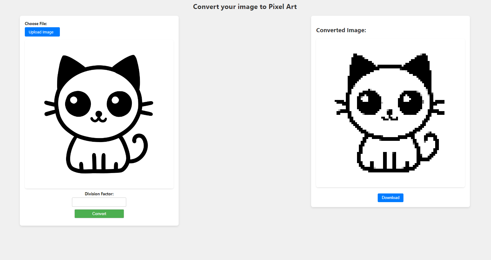

# 🎨 Pixit

## Site

- [Pixit Site](http://lucak.pythonanywhere.com): http://lucak.pythonanywhere.com


## About

Pixit is a web application that allows users to convert their images into pixel art.

<div style="text-align: center;">
  
</div>

## Built With

- [Python](https://www.python.org/): Programming language
- [Flask](https://flask.palletsprojects.com/): Python web framework
- [Pillow](https://python-pillow.org/): Python library for image manipulation

## Getting Started

### Prerequisites

Before you start, make sure you have the following requirements:

- You have Python installed on your machine.

### Installation

To set up the project on your local machine and install the necessary dependencies, follow these steps:

1. **Clone the Repository**

    ```bash
    git clone https://github.com/Lucack/pixit.git
    ```

2. **Install Dependencies**

    ```bash
    pip install -r requirements.txt
    ```

3. **Run the Application**

    ```bash
    python app.py
    ```

Now, you can access the application in your browser at [http://localhost:5000](http://localhost:5000). Or click on the link that will appear in the terminal! 😉

### How to Use

1. Upload an image of your choice.
2. Choose the division factor for pixelating the image.
3. Click on "Convert" to generate the pixel art.
4. View and download the converted image.


## Author

- Name: Lucas Santana Santos
- GitHub: [Lucack](https://github.com/Lucack)
